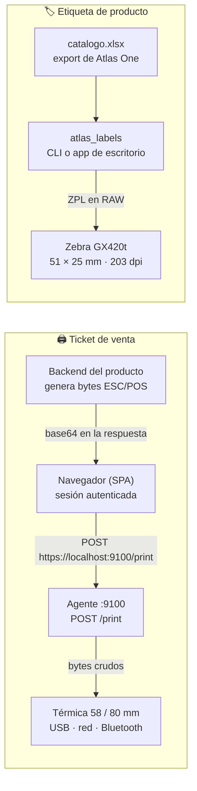

<div align="center">

<br/>

# 🖨️ ATLAS PRINT AGENT
### Impresión de punto de venta para los sistemas de Atlas Technologies

**Un solo repo para las dos cosas que se imprimen en una tienda: el ticket térmico de la caja y la etiqueta de producto del almacén.**

<br/>

*Desarrollado por **Atlas Tech** · En producción para Atlas One y Atlas Rmazh*

<br/>

[](#)
[](#)
[](#)
[](#)
[](#)
[](#)
[](#)

</div>

---

## 📌 Qué es

Dos herramientas independientes que comparten un objetivo: que el personal de tienda imprima sin abrir una terminal.

| Pieza | Qué hace | Estado |
|---|---|---|
| 🖨️ **Agente de impresión** (`legacy/print_agent/`) | Corre en la PC de la caja, expone `https://localhost:9100` y escribe bytes ESC/POS crudos en la térmica por USB, red o Bluetooth. Lo llama el navegador; el ticket lo genera el backend del producto. | **v3.0.0 en producción.** Se está reestructurando en un paquete unificado — ver [Siguientes pasos](#-siguientes-pasos). |
| 🏷️ **App de etiquetas** (`atlas_labels/`) | Lee el catálogo que exporta Atlas One (`catalogo_YYYY-MM-DD.xlsx`) y manda etiquetas ZPL de 51 × 25 mm a una Zebra GX420t. CLI + app de escritorio con filtros, copias por fila y vista previa gráfica. | **En producción.** `.exe` de doble clic para Windows. |

Cada producto (Atlas One, Atlas Rmazh, los que sigan) llevaba su propia copia del agente en `tools/print_agent/` y las copias ya habían divergido. Aquí se consolidan, para que un arreglo se haga una vez y sirva a todos.

> **¿Eres un agente de IA?** Si trabajas **en este repo**, lee [`AGENTS.md`](AGENTS.md). Si trabajas en un repo que **consume** el agente (Atlas One, Rmazh, Booking), lee [`docs/integracion-agentes.md`](docs/integracion-agentes.md).

---

## 🏗️ Arquitectura

Dos flujos que no se tocan entre sí: el ticket nace en el backend y pasa por el navegador; la etiqueta nace en un Excel y no pasa por ningún servidor.



El agente **nunca** habla con el backend y el backend **nunca** habla con el agente. La generación del ticket se queda en cada producto; el agente solo entrega bytes al dispositivo. El sello `ticket_printed_at` lo pone el backend cuando el navegador confirma que el agente respondió 2xx.

---

## 🖨️ Usar el agente de impresión

Requiere Python 3.10 o superior (en macOS basta el 3.9.6 de las herramientas de Xcode).

### Instalación por sistema

| Sistema | Comando | Resultado |
|---|---|---|
| **Windows** | doble clic en `legacy/print_agent/impresora_win.bat` | Crea venv, instala dependencias, genera certificado y arranca. **No queda como servicio**: tras reiniciar hay que volver a ejecutarlo. |
| **Ubuntu** (hoy) | `bash legacy/print_agent/impresora_linux.sh` | Instala CUPS si falta, venv, certificado, grupo `lpadmin`. **La ventana debe quedar abierta.** |
| **Ubuntu** (destino) | `sudo bash legacy/print_agent/core/instalar-servicio-linux.sh` | Unidad systemd `atlas-print-agent` habilitada al arranque: la cajera no abre nada. |
| **macOS** (destino) | `bash legacy/print_agent/core/instalar-servicio-mac.sh` | LaunchAgent `com.atlasone.print-agent` con `RunAtLoad` + `KeepAlive`. Sin sudo. |

Para correrlo a mano durante el desarrollo:

```bash
cd legacy/print_agent/core
python -m venv venv && source venv/bin/activate   # Windows: venv\Scripts\activate
pip install -r requirements.txt                   # o requirements_linux.txt / requirements_mac.txt
python main.py
```

### Comprobar que vive

```bash
curl -k https://127.0.0.1:9100/health     # {"status":"ok","service":...,"version":"3.0.0","os":...}
curl -k https://127.0.0.1:9100/printers   # lista de colas locales
```

### Las tres trampas que siempre muerden

1. **El certificado autofirmado hay que aceptarlo una vez por PC.** Abre `https://127.0.0.1:9100/health` en el navegador de la caja y continúa. Sin esto, todo `fetch` falla aunque el agente esté corriendo.
2. **Chrome pide permiso de "Acceso a la red local"**, por sitio y por PC. Hasta concederlo el preflight falla. El agente ya manda `Access-Control-Allow-Private-Network: true`. Si cambia el dominio del POS, hay que conceder el permiso otra vez en cada terminal.
3. **`ATLAS_AGENT_ORIGINS` es obligatorio si el POS se sirve desde un dominio propio** (`https://pos.micliente.com`). Los de fábrica — `localhost`, `*.up.railway.app` y `*.atlasone.com.mx` — ya entran sin configurar nada. Sin la variable, la sucursal vende pero no imprime.

Variables: `ATLAS_AGENT_HOST` (default `127.0.0.1`), `ATLAS_AGENT_PORT` (default `9100`), `ATLAS_AGENT_ORIGINS` (orígenes CORS extra, separados por coma).

El detalle completo — API, logs, manejo de errores del spooler, instalación por sistema — está en [`legacy/print_agent/README.md`](legacy/print_agent/README.md). El contrato para quien integra desde otro repo, en [`docs/integracion-agentes.md`](docs/integracion-agentes.md).

---

## 🏷️ Usar la app de etiquetas

### Lo normal: doble clic

En la PC de almacén, doble clic en `dist\Atlas Labels.exe` (o el acceso directo **Atlas Labels** del escritorio). No necesita terminal ni Python. Adentro:

1. **Abrir catálogo** — acepta `.xlsx`, `.xlsm` o `.csv`; si el libro trae varias hojas, pregunta cuál.
2. Filtra por **Departamento**, **Género** o texto libre (SKU, código, marca, nombre).
3. La columna **Etiquetas** arranca igual a `Stock` y se edita con doble clic. "Usar existencia" y "Poner N a seleccionados" cambian varias filas de golpe.
4. Selecciona una fila para ver la etiqueta dibujada tal como saldrá (pestaña **Etiqueta**) y el ZPL crudo (pestaña **ZPL**).

El `.exe` no se versiona. Si cambia el código de `atlas_labels/`, hay que regenerarlo: en PowerShell, desde la raíz del repo, `.\installers\labels\build_exe.ps1`.

### Línea de comandos

```bash
pip install -r requirements-labels.txt

python -m atlas_labels impresoras
python -m atlas_labels prueba --impresora "ZDesigner GX420t (EPL)"
python -m atlas_labels imprimir catalogo.xlsx --impresora "ZDesigner GX420t (EPL)" --dry-run
python -m atlas_labels imprimir catalogo.xlsx --sku CH-PLAY-EP-CH --copias 2
python -m atlas_labels.gui
```

**Corre siempre `--dry-run` antes de un lote grande:** las copias por defecto son la columna `Stock`, y el export completo de Atlas One genera cientos de etiquetas. Acota con `--sku`, `--buscar` o `--copias N`.

### La trampa de la Zebra

**La impresora debe estar en modo ZPL.** Que la cola de Windows se llame `ZDesigner GX420t (EPL)` no importa — se imprime en RAW. Pero si la etiqueta de prueba no sale, la impresora está físicamente en EPL: cámbiala con Zebra Setup Utilities. Es el 90 % de los "no imprime nada".

Detalles, mapeo de columnas del catálogo y el uso desde WSL con el Python de Windows en [`atlas_labels/README.md`](atlas_labels/README.md).

---

## 🗺️ Mapa del repo

| Ruta | Qué es |
|---|---|
| `atlas_labels/` | **Producción.** Paquete de etiquetas ZPL: `catalog` (lee el Excel), `barcode` (EAN-13 / Code 128), `zpl` + `render` (una sola fuente de layout para impresión y preview), `batch`, `printer`, `cli`, `gui`. |
| `installers/labels/` | `build_exe.ps1`: empaqueta la app con PyInstaller y deja el acceso directo en el escritorio. |
| `legacy/print_agent/` | **Producción.** Agente v3.0.0 importado tal cual desde Atlas One (la versión más reciente de las dos). Es la referencia durante la migración; no se le hacen features nuevas. |
| `legacy/tests/` | Tests autocontenidos de CORS y de nombres de cola, importados de Rmazh. Contra la base de Atlas One fallan 3 **a propósito** (ver abajo). |
| `tests/labels/` | Suite de la app de etiquetas. |
| `docs/superpowers/specs/` | Diseños aprobados: [agente unificado](docs/superpowers/specs/2026-09-21-atlas-print-agent-design.md), [etiquetas](docs/superpowers/specs/2026-09-21-etiquetas-zebra-design.md), [app v2](docs/superpowers/specs/2026-09-21-atlas-labels-gui-v2-design.md). |
| `docs/reference/` | Notas de campo: CUPS y térmicas en Ubuntu, runbook de autoarranque, auditoría de impresión offline. |
| `docs/integracion-agentes.md` | Contrato para los repos que consumen el agente. |
| `AGENTS.md` | Convenciones e invariantes para quien desarrolla aquí dentro. |

---

## 🧪 Pruebas

```bash
# App de etiquetas — 122 pasan
uv run --no-project --with openpyxl --with pytest python -m pytest tests/labels -q

# Agente legado — 27 pasan, 3 fallan a propósito
uv run --no-project --with fastapi --with uvicorn --with pydantic --with cryptography --with pytest \
  python -m pytest legacy/tests -q
```

**Los 3 que fallan son el pendiente, no un bug.** Son los tests de Rmazh corriendo contra la base de Atlas One, y marcan exactamente lo que Rmazh acepta y Atlas One todavía no:

| Test que falla | Qué exige |
|---|---|
| `test_queue_name_accepts_legit_names[BT:Impresora 58]` | El prefijo `BT:` para colas Bluetooth. |
| `test_queue_name_accepts_legit_names[\\PC-CAJA\POS-80]` | Nombres UNC de impresora compartida en red. |
| `test_sin_la_variable_el_dominio_propio_se_rechaza` | Que un dominio propio sin `ATLAS_AGENT_ORIGINS` sea rechazado. |

**El agente unificado debe pasar los 30.** Ese es el criterio de aceptación de la migración.

---

## 🚀 Siguientes pasos

1. Aprobar sección por sección el [diseño del agente unificado](docs/superpowers/specs/2026-09-21-atlas-print-agent-design.md) (§5.1 a §5.6).
2. Escribir el plan de implementación.
3. Reestructurar el agente en el paquete `atlas_print_agent/` con backends CUPS, spooler de Windows y Bluetooth SPP.
4. Empaquetar con PyInstaller e instaladores nativos (`.deb`, `.exe`, `.pkg`) desde GitHub Actions.
5. Cambiar el endpoint `download-agent` de cada producto para que redirija a las releases de este repo.

---

<div align="center">
<sub>Atlas Technologies · El agente es un tubo de bytes: recibe base64 y lo escribe en el dispositivo.</sub>
</div>
