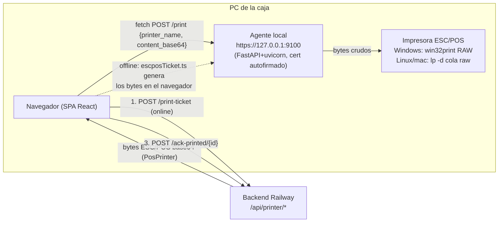
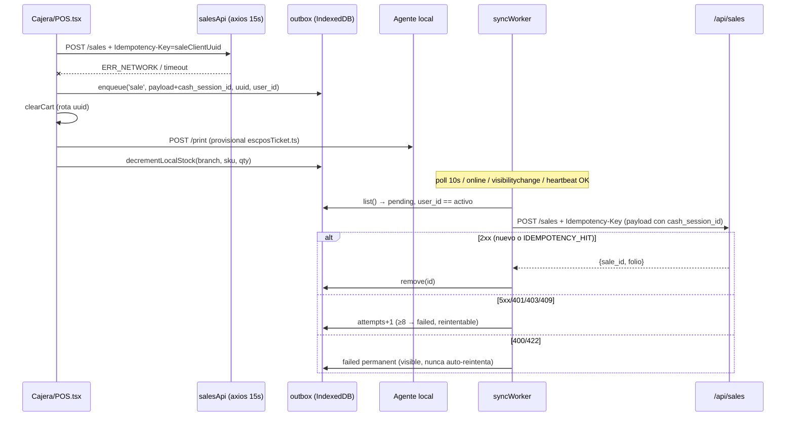

# 04 — Impresión térmica y venta offline (auditoría de solo lectura, 2026-09-07)

Rama auditada: `feat/latencia-instrumentada` (= `release/beta` + 1 commit de observabilidad). Nada se editó.

## 1. Arquitectura de impresión

- **Quién genera bytes.** Online, siempre el backend: `PosPrinter.build_ticket_bytes` (`app/pos_printer.py:254`) invocado por `/api/printer/print-ticket` (`app/routers/printer.py:346-463`), `reprint-ticket` (:508), `reprint-refunded` (:586) y `print-cash-cut` (:671). Offline, el navegador construye un ticket PROVISIONAL sin folio ni logo con `buildProvisionalTicket` (`frontend/src/offline/escposTicket.ts:452-542`). El backend **nunca** imprime: "Track 4: TODA la impresión va por agente local" (`frontend/src/api/printer.ts:550-553`); `_record_print_job` guarda un `PrintJob` con status `PRINTED` solo por haber entregado bytes (`printer.py:123-141`).
- **Descubrimiento del agente.** No hay descubrimiento: la URL es constante `AGENT_BASE = 'https://localhost:9100'` (`api/printer.ts:291`). Ping con `AbortSignal.timeout(2000)` a `/health` (`:392-399`), lista de impresoras en `/printers` con 3 s (`:371-379`), diagnóstico `/diagnostics` cada 10 s mientras la pantalla de config esté abierta (`AgentDiagnosticsPanel.tsx:345-363`). La PC descarga el agente en ZIP desde `/api/printer/download-agent?platform=` (`printer.py:276-334`), que empaqueta `tools/print_agent/` filtrado por plataforma.
- **Config por sucursal vs. por terminal.** La config de *papel* vive en `Branch`: `printer_name, paper_width_mm, printer_cols, ticket_font, ticket_layout, open_drawer_on_print, ticket_header/footer` (`app/models/organization.py:76-84`), editada con `PUT /branches/{id}` desde `PrinterSettings.tsx:206-232`. La *impresora física de esta PC* vive en `posStore.printerName` (localStorage `LS_PRINTER_KEY`, `store/posStore.ts:138,331-334`) y es la que usa el POS al imprimir (`POS.tsx:79,157-165`). El espejo para offline (`atlas_pos_printer_settings`, localStorage) se rescribe en cada carga/guardado/selección (`PrinterSettings.tsx:137-146,194-203,220-229`; `offline/printerSettingsCache.ts:531-537`). Nota: `Branch.printer_name` es un solo nombre por sucursal aunque haya N PCs — el backend lo usa solo como *hint* de ancho (`printer.py:86-111`).
- **Cuando el agente no responde.** Online: `printNewTicketViaAgent` rechaza → toast "Ticket guardado pero no se pudo imprimir" (`POS.tsx:165-169`); la venta ya está comprometida. Offline: la impresión del provisional es best-effort dentro de `try/catch` y no afecta al enqueue (`POS.tsx:315-345`). El fetch al agente en `/print` **no tiene timeout** (`api/printer.ts:526-535`), a diferencia de ping/diagnostics.
- **Sello `ticket_printed_at`.** Ya no lo pone `/print-ticket` (`printer.py:437-445`); lo pone `POST /ack-printed/{sale_id}` (`:466-505`), idempotente, que el frontend llama **solo después** de que el agente respondió 2xx (`api/printer.ts:594-600`). El ack es best-effort (`.catch(() => {})`). Dentro de la ventana de 10 min de venta propia, la 1.ª impresión es ORIGINAL y la 2.ª en adelante sale con `*** REIMPRESION ***` + `reprint_count` + auditoría (`printer.py:42,390-401,446-458`).
- **Permiso de Chrome.** El agente manda `Access-Control-Allow-Private-Network: true` y tiene handler explícito de preflight (`tools/print_agent/core/main.py:146-172`); CORS admite `*.up.railway.app` + `ATLAS_AGENT_ORIGINS` (`main.py:120-137`). Pero Chrome exige además el permiso "Acceso a la red local" **por sitio y por PC** (memoria `chrome-local-network-access.md`): nada en la UI lo detecta ni lo explica — el banner dice "acepta el certificado" (`PrinterSettings.tsx:491`, `AgentDiagnosticsPanel.tsx:373-376`), que es otro problema distinto.

## 2. Los tres espejos del ticket y el fixture golden

| Espejo | Archivo | Qué reproduce |
|---|---|---|
| Fuente de verdad | `app/pos_printer.py` (`PosPrinter`, 1718 LOC) | COMPACT/DETAILED (`:93-98,185-191`), 58 mm→32 cols / 80 mm→56 cols (`:64-65,139-143`), override `cols` en `[24,64]` (`:90-91`), Font A/B (`:170-183`), logo rasterizado con caché por `(path, ancho)` (`:18-31,1550+`) |
| Preview | `components/pos/TicketPreview.tsx` | `productLine` (`:138`), `totalLine` (`:191`), DETAILED (`:209+`), header/footer con centinelas legacy (`:13-51`), `buildFooterLine` (`:387`) |
| Offline | `offline/escposTicket.ts` | `resolveCols/Font/Layout` (`:69-100`), `productLine` (`:177`), `productLinesDetailed` (`:341`), bloque de pago (`:436`), CP850 manual (`:111-123`) |

Alineación: `tests/test_ticket_golden.py` regenera **en memoria** desde `PosPrinter._product_line/_product_lines_detailed` y compara contra `frontend/src/__fixtures__/ticket-golden.json` (`:233-251`); si el backend cambia sin regenerar (`REGEN_TICKET_GOLDEN=1`), falla. Los dos espejos TS leen ese mismo JSON: `escposTicket.test.ts:423-449` y `TicketPreview.test.tsx`. Hoy el fixture tiene 10 casos COMPACT, 19 DETAILED, 6 TOTALS. **Cobertura del fixture: solo líneas de producto y totales** — el bloque de pago, el header, el footer y el resumen de piezas se prueban por espejo pero no cruzados (VERIFICADO leyendo las claves del JSON). El provisional además omite a propósito logo, folio, IVA desglosado por línea y devoluciones, y añade `*** PENDIENTE - SIN FOLIO ***` (`escposTicket.ts:525-528`) — no es byte-idéntico ni pretende serlo.

## 3. Arquitectura offline

**IndexedDB** `atlas_pos_offline` v2 (`offline/db.ts:5-8`): stores `outbox` (keyPath `id`) y `catalog` (keyPath `key`); migra el store v1 `pending_sales` a `outbox` tipo `sale` (`:19-38`).

**Outbox** (`offline/outbox.ts:68-89`): `{id, type: sale|cash_open|cash_close|return, payload, idempotency_key, enqueued_at, attempts, status: pending|syncing|failed, last_error, permanent?, user_id?}`. Se sella **solo `user_id`**; ni `organization_id` ni `branch_id` viajan en la op — los pone el interceptor al drenar (`api/client.ts:240-248`). El `cash_session_id` va **dentro del payload** y solo en el enqueue offline, nunca en el POST online (`POS.tsx:230-241,306-310`; `pages/pos/salePayload.ts:20-21`). La `idempotency_key` es el `saleClientUuid` del carrito, reutilizado del intento online fallido (`POS.tsx:295-300`; `posStore.ts:22-38`). En la práctica **solo `sale` se encola**: `cash_open/cash_close/return` están mapeados (`syncWorker.ts:162-167`) pero ningún caller los usa (grep en `frontend/src`: solo `enqueue('sale', …)` en `POS.tsx:310`).

**syncWorker** (`offline/syncWorker.ts`): `drainOnce` es serial, con mutex `draining` (`:210,226`), salta `failed` y ops de otro usuario (`:230-249`); POST con header `Idempotency-Key` (`:178-189`). 2xx → `remove`; 5xx/401/403/409 → reintentable con tope `MAX_RETRY_ATTEMPTS = 8` (`:195,206-208,255-258`) → `failed` no-permanente; 400/422 → `failed permanent` (`:259-264`); error de red → `pending` para siempre, sin contar (`:265-278`). `resetNonPermanentFailedOps` reencola al volver la conectividad real (`:319-325`). Disparadores en `hooks/useOfflineQueue.ts:34-57`: poll 10 s si `navigator.onLine`, evento `online`, `visibilitychange`, y `onConnectivityChange(true)` (heartbeat).

**Backend del replay** (`app/routers/sales.py`): dedupe por `client_uuid` + índice `uq_sales_org_client_uuid` incluso en carrera (`:536-570,1040-1062`); `cash_session_id` propio se acepta OPEN o CLOSED ≤ 72 h (`:606-653`), ajeno → 403, viejo → 409.

**catalogCache** (`offline/catalogCache.ts`): snapshot por `branch:{id}` con `cached_at` (`:337-346`); `refreshCatalog` pide `GET /products/pos/search?q=&order_by=best_sellers` (`:402-411`) **una sola vez al montar `ProductSearch`** si hay red (`components/pos/ProductSearch.tsx:131-134`); búsqueda offline por `includes` en nombre/sku/barcode (`:359-369`); `decrementLocalStock` resta por SKU tras cada venta offline (`:376-398`). No hay TTL, no hay refresco periódico, no hay aviso de antigüedad al cajero.

**connectivity** (`offline/connectivity.ts`): online = `navigator.onLine` AND `fetch('/health')` con 4 s (`:415-436`), cada 15 s + eventos (`:455-466`). `isNetworkError` decide qué se encola: sin `response`, `ECONNABORTED/ERR_NETWORK/ETIMEDOUT`, mensajes de red o `navigator.onLine === false` (`:477-488`). El axios global tiene `timeout: 15000` (`api/client.ts:221-225`).

## 4. Service worker / PWA

- `registerType: 'prompt'` (`frontend/vite.config.ts:16`), `clientsClaim: true` (`:54`), `cleanupOutdatedCaches: true` (`:131`) y **`skipWaiting: true`** (`:164`) marcado como *TRANSICIONAL, "no dejar viviendo más de un deploy"* (`:133-163`). El gate `createUpdateGate` (`pwa/updateGate.ts:23-44`) solo recarga con click en `UpdateAvailableBanner.tsx:43`; el banner advierte si hay cobro en curso o carrito (`updateGate.ts:52-56`).
- Precache: `**/*.{js,css,html,ico,png,svg,woff2}` de `dist/`, `navigateFallback: '/index.html'`, `/api/` y `/static/` excluidos del fallback y `/api/` en `NetworkOnly` (`vite.config.ts:113-130`). El heartbeat a `/health` no cae en ninguna regla → red directa (correcto). No se cachea ninguna respuesta de negocio: sin red, la SPA arranca (shell) pero solo el POS con snapshot de catálogo es utilizable.
- Recuperación de chunk viejo: `handleStaleChunk` recarga **automáticamente** una vez ante "Failed to fetch dynamically imported module" (`main.tsx:17-37`).
- **Riesgo real en deploy a media venta (VERIFICADO por lectura de `node_modules/vite-plugin-pwa/dist/client/build/register.js:41-56` + config).** Con `skipWaiting:true` el SW nuevo se activa y reclama la pestaña sin click; `cleanupOutdatedCaches` borra los chunks viejos; cualquier ruta lazy que la pestaña aún no cargó (modal de devolución, historial, config de impresora) falla y `main.tsx:28` recarga la página sin preguntar. Si además workbox-window alcanza a ver el estado `waiting`, el propio registro en modo prompt instala un listener `controlling → window.location.reload()` (`register.js:44-51`), también sin click. El carrito y el `saleClientUuid` sobreviven al reload (`posStore.ts:392-418`), así que un `POST` cortado se dedupea al reintentar — pero el cajero pierde el modal de cobro y el toast. El commit transicional es `a328d75` (2026-08-21) y desde entonces `release/beta` lleva 26 commits, con al menos un deploy a PROD (scanner, 2026-08-29): **el `true` ya vivió más de un deploy.**

## 5. Hallazgos (VERIFICADO = leído en código; HIPÓTESIS = inferido, sin reproducir)

| # | Sev | Hallazgo | Evidencia |
|---|---|---|---|
| H1 | **P0** | **El catálogo offline tiene como máximo 20 productos.** `refreshCatalog` cachea la respuesta de `/products/pos/search?q=` y ese endpoint hace `.limit(20)` incondicional. En un corte de red la cajera solo encuentra los 20 más vendidos; cualquier otro SKU "no existe". Precios stale además: sin TTL ni refresco. VERIFICADO. | `offline/catalogCache.ts:79`; `app/routers/products/search.py:179`; `ProductSearch.tsx:131-134` |
| H2 | **P1** | `skipWaiting: true` transicional sigue vivo 26 commits después: cada deploy puede recargar la pestaña a media venta sin click (ver §4). VERIFICADO el mecanismo; HIPÓTESIS que haya ocurrido en tienda. | `vite.config.ts:54-86`; `main.tsx:19-29`; `register.js:44-51` |
| H3 | **P1** | **"Impreso" = "el spooler aceptó el trabajo", no "salió papel".** `_print_windows` devuelve `success` tras `WritePrinter`; `_print_unix` tras `lp` encolar. Impresora apagada/sin papel → Windows encola el job, el agente responde 200, el POS hace `ack-printed` y el ticket queda sellado ORIGINAL sin papel; al reintentar sale como REIMPRESION (el caso que N6 quiso evitar). VERIFICADO en código; HIPÓTESIS sobre el comportamiento exacto del spooler con impresora offline. | `tools/print_agent/core/main.py:945-1013,1016-1061`; `api/printer.ts:594-600`; `printer.py:466-505` |
| H4 | **P1** | `printViaAgent` (venta, provisional, corte, cajón) hace `fetch` **sin timeout**. Si el agente está colgado (no caído), el flujo online es fire-and-forget (bien), pero la rama offline hace `await` del provisional antes del toast de "venta guardada" — la cajera puede quedarse sin confirmación aunque la venta ya esté en la cola. VERIFICADO. | `api/printer.ts:526-535`; `POS.tsx:328-331,355-362` |
| H5 | **P1** | Permiso "Acceso a la red local" de Chrome: la UI atribuye todo fallo del agente al certificado ("acepta el certificado SSL"), no hay detección ni instrucción del permiso; al migrar a `rmazh.atlasone.com.mx` las 17 tiendas dejan de imprimir hasta conceder el permiso PC por PC. VERIFICADO (memoria + código). | `PrinterSettings.tsx:480-495`; `AgentDiagnosticsPanel.tsx:366-386`; memoria `chrome-local-network-access.md` |
| H6 | **P2** | Después de sincronizar una venta offline no se imprime ni se ofrece el ticket con folio: el cliente se fue con un provisional "SIN FOLIO" y el cajero (rol CAJERO) necesita PIN de admin para reimprimir desde historial. No hay listado de "ventas sincronizadas hoy que solo tienen provisional". VERIFICADO (`drainOnce` solo `remove`). | `syncWorker.ts:253-254`; `SalesHistory.tsx:320-327`; `printer.py:151-194` |
| H7 | **P2** | La op del outbox no sella `organization_id`/`branch_id`: al drenar, el interceptor manda los del holder actual. Con usuarios de una sola org el riesgo es nulo; con un multi-org (admin/soporte) que vende offline y cambia de org, la venta se crearía en la org equivocada. HIPÓTESIS (no encontré un cajero multi-org). | `outbox.ts:68-89,101-125`; `api/client.ts:240-248` |
| H8 | **P2** | El agente escucha sin autenticación y CORS acepta **cualquier** `https://*.up.railway.app`: una página de terceros en Railway abierta en la PC de caja podría llamar `/drawer/open` o `/print`. Mitiga el permiso de red local de Chrome (por sitio). HIPÓTESIS de explotación; VERIFICADA la regex. | `main.py:120-144,571-586` |
| H9 | **P2** | El cajero de otra PC no ve "N ventas offline" de esta terminal: la cola es local a IndexedDB del navegador; si la PC se reinstala o se limpia el perfil de Chrome antes de drenar, las ventas cobradas en efectivo desaparecen sin rastro en el servidor. No hay export/rescate. VERIFICADO por diseño. | `db.ts`, `outbox.ts` |
| H10 | **P2** | `decrementLocalStock` permite stock negativo y el POS offline no lo bloquea; combinado con H1, la precisión de existencias offline es cosmética. VERIFICADO (test lo asume). | `catalogCache.ts:376-398`; `decrementLocalStock.test.ts:28` |
| H11 | **P3** | Tres instancias simultáneas de `useOfflineQueue` (Layout, POS, SalesHistory) → 3 pollers de 10 s + 3 heartbeats de 15 s por pestaña; `draining` evita drenajes concurrentes pero no el tráfico. VERIFICADO. | `OfflineQueueBanner.tsx:10`; `POS.tsx:80`; `SalesHistory.tsx:49` |
| H12 | **P3** | Instrucción Linux cita `sudo ./install_systemd.sh`, archivo inexistente; el real es `core/instalar-servicio-linux.sh`. VERIFICADO. | `PrinterSettings.tsx:632`; `INSTALL_LINUX.txt:35` |
| H13 | **P3** | Windows: el `.bat` exige Python en PATH, corre `pip install` en cada arranque, no se instala como servicio ni en Inicio (Linux sí tiene systemd) → tras reiniciar la PC la cajera debe volver a hacer doble clic; libera el puerto 9100 matando procesos ajenos. VERIFICADO. | `impresora_win.bat:38-54,57-59,74-81,100-105` |
| H14 | **P3** | El asistente de instalación (`PrinterInstallWizard`) habla de `lpinfo -v`, "cola CUPS", "modo raw", "lpadmin -p …" — vocabulario de sysadmin para una cajera; en Windows el wizard ni aplica (`/printers/detect` es Linux/mac). VERIFICADO. | `PrinterInstallWizard.tsx:150-154,206-218,243,254` |
| H15 | **P3** | `PrintJob.content` guarda el base64 completo de **cada** ticket, reimpresión y corte, sin purga. Crecimiento lineal de la tabla. VERIFICADO. | `printer.py:123-141`; `app/models/print_job.py:18` |
| H16 | **P3** | `saveTicketSettings` se rescribe solo al visitar PrinterSettings: si un admin cambia el layout/ancho de la sucursal desde otra PC, esta terminal imprime el provisional offline con la config vieja hasta que alguien abra la pantalla. HIPÓTESIS. | `PrinterSettings.tsx:137-146`; `POS.tsx:320` |

Lo que está bien y conviene no tocar: idempotencia extremo a extremo (uuid estable por carrito, dedupe por índice único, resolución de carrera); atribución de turno con `cash_session_id` + ventana 72 h; ack post-confirmación; identidad sellada por op y doble comprobación contra el holder de la pestaña (`syncWorker.ts:230-249`); el interceptor de 401 no toca IndexedDB (`client.ts:255-277`); FINAL-03 (error de red nunca agota el tope).

## 6. Tests existentes y huecos

**Existentes.** Backend: `test_ticket_golden.py` (fixture cruzado), `test_ticket_layout*.py` (COMPACT byte-idéntico), `test_payment_block_width.py`, `test_pos_printer*.py`, `test_printer_endpoints.py` (cajón en corte), `test_reprint_pin.py`, `test_sales_idempotency_active.py` (3 casos), `test_sales_offline_cash_session.py` (6 casos: CLOSED ≤72 h, >72 h, ajeno, sin sesión), `test_print_agent_cors.py` (8), `test_print_agent_queue_name.py`. Frontend (vitest, `environment: node`): `syncWorker.test.ts` (21 casos: 2xx/4xx/5xx/401/409, tope, FINAL-03, filtro por usuario), `outbox.test.ts` (7), `catalogCache.test.ts` (2), `decrementLocalStock.test.ts` (3), `connectivity.test.ts` (3), `db.test.ts` (1), `printerSettingsCache.test.ts` (10), `escposTicket.test.ts` (36), `TicketPreview.test.tsx` (30), `updateGate.test.ts` (10), `api/__tests__/printer.test.ts` (ack post-confirmación, cajón), `client.test.ts` (timeout, 401 no toca outbox), `sessionResolution.test.ts`, `saleItemsToProvisionalLines.test.ts`.

**Huecos.**
1. Ningún test cubre que `refreshCatalog` traiga el catálogo **completo** (H1) — `catalogCache.test.ts` inyecta el snapshot a mano.
2. Migración IndexedDB v1→v2 (`db.ts:19-38`) sin test.
3. `db.test.ts` prueba apertura; no hay test de `openDB` fallando (Safari privado / cuota) ni de que `enqueue` rechazando deje la venta visible al cajero (`POS.tsx:310` lanza dentro de `try` → cae al `catch` genérico, sin cobertura).
4. El fixture golden no incluye bloque de pago, header, footer, resumen de piezas ni la línea `SIN FOLIO` (§2).
5. Sin test de integración "venta offline → drenaje → IDEMPOTENCY_HIT" ni de "replay con 409 por sesión >72 h termina en `failed` visible".
6. `handleStaleChunk` (recarga automática) y la interacción con `skipWaiting:true` no tienen test — ni existe el "query de telemetría de versión de SW" que el propio TODO exige antes de revertir (`vite.config.ts:157-159`).
7. Agente: `_print_windows/_print_unix` no tienen test (solo CORS y nombre de cola); no hay test de que `/print` con impresora inexistente devuelva 500 (para que el POS no haga ack).
8. `useOfflineQueue` y `OfflineQueueBanner` sin test (vitest sin jsdom).
